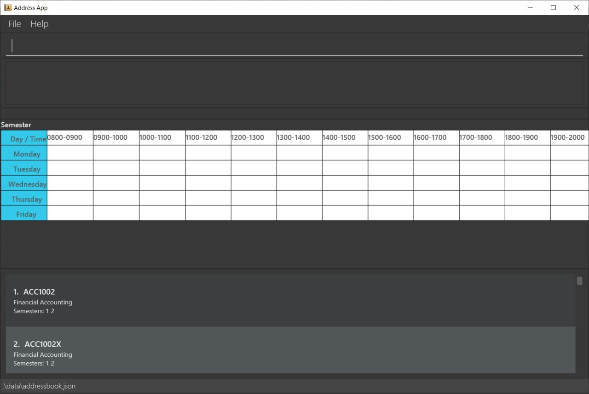

= NUS Module Planner
ifdef::env-github,env-browser[:relfileprefix: docs/]

https://travis-ci.com/AY1920S2-CS2103T-W13-4/main.svg?branch=master[image:https://travis-ci.org/se-edu/addressbook-level3.svg?branch=master[Build Status]]
https://coveralls.io/github/AY1920S2-CS2103T-W13-4/main[image:https://coveralls.io/repos/github/AY1920S2-CS2103T-W13-4/main/badge.svg[Coverage Status]]

ifdef::env-github[]

endif::[]

ifndef::env-github[]
image::images/Ui.png[width="600"]
endif::[]

* We intend to create a NUS Module Planner that would be able to allow both prospective and existing
students to be able to select their course, specialisations/tracks, and other special module arrangements.
After doing so, the application will determine the most optimised fit for modules and their dependencies
for a full 3-4 years, in the hopes of easing students and their module plannings, as they go through the years.
The application should then allow for adjustments to the module plan, in case there are changes to the curriculum,
or if the user would prefer an alternative set of modules in any arbitrary semester.
* It is a Java application intended for us to learn and experiment on Software Engineering while
using Java as the main programming language.

== Site Map

* <<UserGuide#, User Guide>>
* <<DeveloperGuide#, Developer Guide>>
* <<LearningOutcomes#, Learning Outcomes>>
* <<AboutUs#, About Us>>
* <<ContactUs#, Contact Us>>

== Acknowledgements

* The base of this application was derived from the _AddressBook-Level3 project_ created by the https://se-education.org[the SE-EDU initiative].
* Some parts of this sample application were inspired by the excellent http://code.makery.ch/library/javafx-8-tutorial/[Java FX tutorial] by
_Marco Jakob_.
* Libraries used: https://openjfx.io/[JavaFX], https://github.com/FasterXML/jackson[Jackson], https://github.com/junit-team/junit5[JUnit5]

== Licence : link:LICENSE[MIT]
